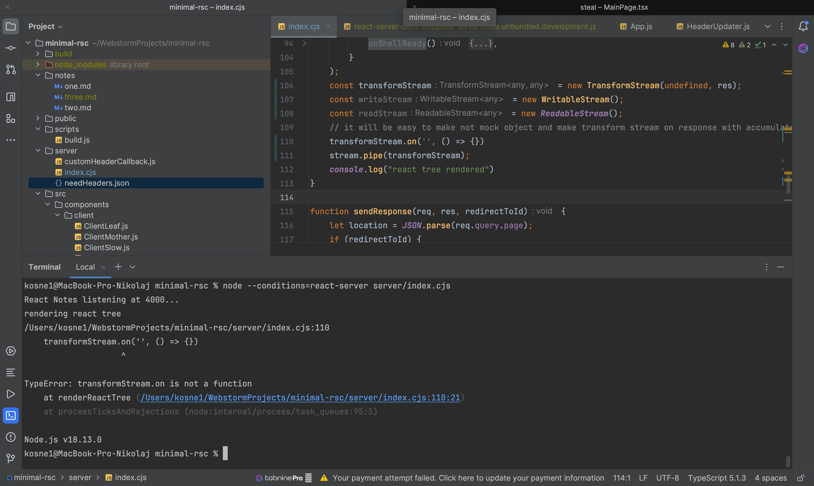
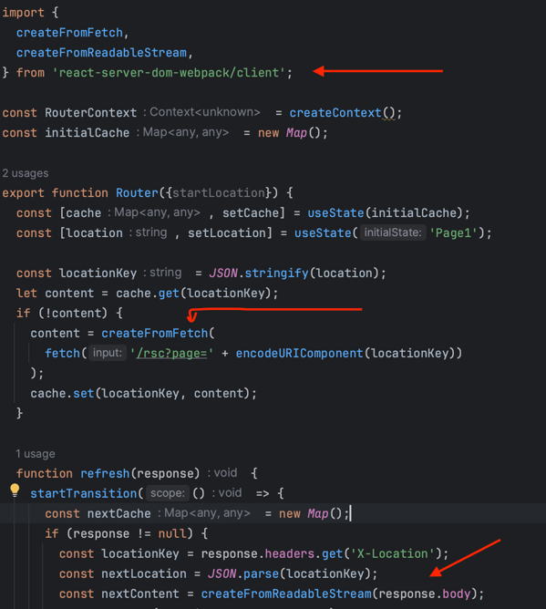
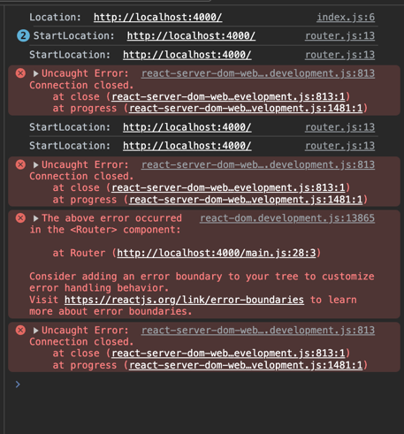
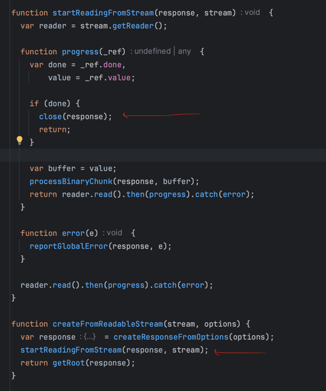
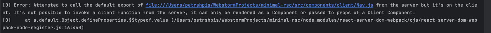

===============================
Tasks

Reimplement Suspense + RSC in plain react + express + webpack without next.js
and observe if anything is different in particular:

* verify that server component source code is not included in client bundle
* that suspence with server components works the same (long polling + JS and hidden <div />) (Done)
* Verify that react client components also work and are fine without next.js (Done)

* How we can use react-helmet in the same way next/redirect was used and for Title,
  maybe <https://react.dev/reference/react-dom/server/renderToPipeableStream#waiting-for-all-content-to-load-for-crawlers-and-static-generation>
  and fix onShellReady by hands
    * helmet inside suspense and helmet outside suspense

=============

## Helmet

Craft customHeadManifest.json by hand by route
const customHeadManifest.json

let counter = 0
window.customHeadCallBack = ()=>{
counter ++;
}
onShellReady() {
if we already have CustomHead data, then patch <head/>
if do not have CustomHead data, then look up if we need to have it

}

<html>
<head>
...
</head>


<App>
  <CustomHead />
</App>

- Only server components
- Top level instant

```
<App>
  <Navbar>
    <CustomHead props={pleaseWait:100,} />
  </Navbar>
</App>
```

- In suspense

```
<App>
  <Suspence>
    (5000ms)=><CustomHead />
    (10ms)=><CustomHead />
  </Suspence>
</App>
```

const pipe === reactRenderToPipabe
const myTranslator = new Stream((chunk)=>{
chunk.replace("title","title2"/g)
})

pipe(myTranslator)
myTranslator(response)

ДЗ:
Создать три стрима
для генерации, трансформации и поедания инфы
readable writable transformer

Таски:
1. попробовать helmet
2. разобраться с версиями реакта
3. разобраться почему калбеки не вызываются
4. исходить из того что needHeaders.json уже есть

5. сделать свой transformer stream над респонсом, через который будет идти

**Ответы:**
1. Проблема библиотеки react-server-dom-webpack, она не работает на версиях react после 18.0.0 и до 18.3.0.
   renderToPipeableStream добавили в обновлении react 18 версии. Есть версии библиотеки для более поздних версий react,
   но они не содержат нужных компонент для данного проекта. Сама библиотека была адаптирована под react 18.3.0 и поэтому
   является неустойчивой, из-за чего происходят проблемы.
2. Callback'и не работают, так как renderToPipeableStream в принципе не запускается, вместо него запускается
   renderToReadableStream. В файле библиотеки(react-server-dom-webpack), в котром должен содержаться renderToPipeableStream
   его нет, за счет чего происходт замена на renderToReadableStream, из чего можно сделать вывод с тем, что на данном этапе
   библиотека не доработана, под все задачи из документации(https://react.dev/reference/react-dom/server/renderToPipeableStream)
   react'а.
3. Вывод, придется создавать свой аналог renderToPipeableStream на эксперементальной версии react/ждать более стабильной
   версии.

Таски от 23.08.2023
1. Сделать мок объект для респонса, вызывающий все методы реса с логированием
2. Отсматривать все логи и понять какие методы вызываются
3. Отправлять хедеры не по чуть-чуть, а сохранять и отправлять сразу все по команде(?)
4. Тоже самое с res.write и res.send(res.send = res.write + res.end + res.setHeader(200) (возможно))
5. общение между сервер компонентами и server/index.cjs через глобальные кал

**Ответы:**
1. Создан Emitter для прослушивания изменения headers из Title внутри renderReactTree. Для корректной работы
   необходимо запустить сервер через терминал: $ node --conditions=react-server server/index.cjs


2. Был проверен вариант с использование TransformStream. При его использовании возникает
   ошибка из-за отсутствия метода .on(), который вызывается внутри renderToPipeableStream.pipe().
3. Создан класс ResponseTransformStream наследованный от Transform, посредством которго выводятся
   чанки respons'а.
4. Получилось поменять внутрености лоадера внутри трансформ стрима. Но без понятия как менять тайтлы или ставить хедеры

Результат от 30.07.2023
1. Сделал компонент тайтл как в хелмете
2. Появились следующие идеи:
    - сделать плагин или скрипт в билде собирающий json с хелметом на этапе билда
    - сделать мультистраничность
    - держать в хелмете json с учетом мультистраничности
    - собирать файл MegaPage.js в build.js перед запуском вебпака
    - изменять хрев в браузере на клиенте при переходе между ссылками

Новые таски 30.10.2023:
1. Переехать на renderToPipeableStream без вебпака
2. Научиться не бегать на /rsc, а выдавать данные по / но кусками
3. Сделать нормальные страницы на разных урлах /page1 /page2

---------
Old school: HTML-ssr
- problem: takes too long to render all
  User with mobile:
-
For google bot: HTML-stream: /contacts/ 200, <title>Contacts</title>
- problem can take long to load, ships parts in hidden div which Google bot may not like
- good one stream not needed JS above the fold
* replace title
* render html stream
* JSON-stream => <html>-stream
  * <div hidden></div>
  * <script></script>
  For client JS: json-stream: /about/ /rsc/ <script>window.title.title=About</script>
  JSON-stream:

Результаты от 30.10.2023:
*  - нашел функции которые делают, то что мы обсуждали
* Попытался сначала запустить нодой сначала скрипт билда(node scripts/build.js) и потом нодой сервер (node --conditions=react-server server/index.cjs)
    * в результате получил норм при первом заходе, но не норм при втором.
    * Причина в react-server-dom-webpack
    * Насколько я понял, проблема в функции createFromReadableStream в router.json
    * Она принимает в себя response, который на второй раз почему-то закрыт :(
    * 
    * Покопавшись в сорсах понял, что она действительно одноразовая, закрывает коннект как приходит весь контент в первый раз
    *  попытка менять сорсы в этом месте привела к последующему изменению большого количества функций, я запутался ничего не заводилось и я бросил это дело, тк решил, что это не важно
* При попытке поменять импорт у renderToPipeableStream получается, что так как нет вебпака, то он начинает пытаться рендерить клиентские компоненты на серваке и падает
    * 
    * renderToNodeStream и renderToStaticNodeStream не завелись по той же причине, что и renderToPipeableStream, что в целом очевидно
    * теперь понятно, что без манифеста в том или ином виде никуда не убежать, наверное можно взять и стырить сорсы renderToPipeableStream из изначальной библиотеки, хотя почти уверен, что там будет куча вебпак магии и ее так просто не вытащить
    * я искренне пытался понять, что там в сорсах, но пока не судьба, думаю надо бы синк, **перехожу на попытку самому превращать json и /rsc в html**
    * Идея: чтобы завелся стандартный renderToSomethingStream необходимо:
        * составить полностью свой манифест или взять готовый или слегка переделать готовый
        * пройтись где-нибудь(на билде мб) по компонентам и поменять все серверное на тег скрипт с их чанком
        * потом собственно прогнать через renderToSomethingStream
        * и потом наверное перевести обратно, чтобы файлики не портить(можно создать копию всей папки src на билде и тогда наверное пофиг)
